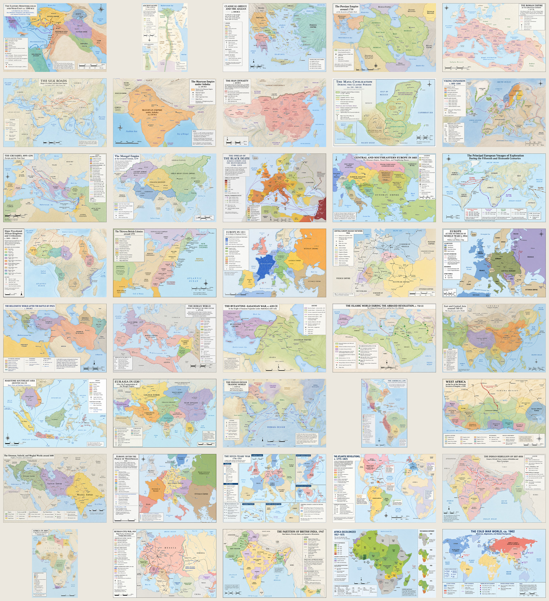

# MapBench

[](https://github.com/strangeloopcanon/mapbench/actions/workflows/validate.yml)

MapBench tests whether an image-generation system can draw a historically and geographically sound map from a written request. The generator receives a subject prompt and no reference image. Its output is judged as a map, without pixel matching or imitation of a source design.

The first public release contains 40 prompts spanning the Late Bronze Age through the Cold War. It includes exact prompts, one-shot generations from two systems, per-map evaluations, the scoring rubric, and machine-readable results.



## Results

**Only 11 of 40 Codex maps (27.5%) and 12 of 40 Gemini maps (30.0%) were free of material errors.**

| Generation system | Material-error-free maps | Maps with material errors | Capped quality mean | Raw quality mean |
| --- | ---: | ---: | ---: | ---: |
| Codex built-in image generator | **11 of 40 (27.5%)** | 29 of 40 (72.5%) | 71.11 | 81.79 |
| Gemini 3.7 Flash High via `agy` and `gemini-3.1-flash-image` | **12 of 40 (30.0%)** | 28 of 40 (70.0%) | 68.20 | 71.75 |

The material-error-free rate is the primary metric. The capped quality mean is not a percentage-correct score or the probability that a map is materially correct. It distinguishes an otherwise strong map with one wrong border from a map whose central historical frame fails, while hard caps prevent visual polish from erasing material errors.

| Reliability category | Codex | Gemini |
| --- | ---: | ---: |
| No material errors | 11 | 12 |
| One non-central material error | 11 | 10 |
| Multiple material errors | 14 | 13 |
| Central-frame failure | 4 | 5 |

Both systems often covered the requested subject and produced finished-looking atlas plates while containing incorrect dates, borders, political classifications, or routes.

The two runs did not use identical evaluator topologies. The Codex run used Sol Medium and Terra High with Sol High adjudication for substantive disagreement. The Gemini run used Sol High alone. The side-by-side figures are exploratory diagnostics, not a controlled model ranking. A shared blind rescore is required before treating either delta as a model effect.

Full reports:

- [Codex image-generation report](results/codex-image/report.md)
- [Gemini agent and image-backend report](results/gemini-agent-image/report.md)
- [Gemini per-map scores](results/gemini-agent-image/per-map.csv)

## What MapBench measures

Each output receives four scores from 0 to 5:

| Dimension | Weight | Question |
| --- | ---: | --- |
| Spatial construction | 40% | Are shapes, locations, extents, adjacency, containment, and movement correct? |
| Factual and semantic correctness | 25% | Are identities, dates, names, sovereignty, categories, and legend meanings correct? |
| Required coverage | 15% | Are the principal requested features present? |
| Cartographic legibility | 20% | Can a reader decode the map at normal viewing size? |

Every defect is assigned once. A missing feature affects coverage; a wrongly placed feature affects spatial construction; a wrong identity or date affects factual correctness; hard-to-read correct information affects legibility.

Material errors cap the final score:

| Condition | Maximum final score |
| --- | ---: |
| No material errors | 100 |
| One material error | 74 |
| Two or more independent material errors | 59 |
| Central subject, period, or political frame is wrong | 39 |
| The requested map is not interpretable | 20 |

This prevents visual polish from compensating for a materially false map. These are quality scores, not accuracy percentages. The uncapped raw score remains useful for comparing drawing quality within the same error band.

Read the complete [v3 rubric](benchmark/rubric.md).

## Protocol

1. Start a fresh generation session for each item.
2. Supply the saved prompt and no reference image.
3. Allow one completed image-generation call and no corrective iteration.
4. Judge the result against the prompt, historical knowledge, and a hidden reference used only as comparative evidence.
5. Record dimension scores, every material error, the applicable cap, and a short judgment.
6. Rank by capped final score, then uncapped raw score, then item ID.

The hidden reference is evidence, not an infallible answer or a target layout. An original projection, palette, typography, or composition is acceptable when the resulting map is correct and readable. See the full [protocol](benchmark/protocol.md).

## Example prompt

```text
Use case: scientific-educational
Asset type: standalone historical atlas map
Primary request: Create a new, historically accurate educational map of The Roman Empire at its greatest territorial extent around 117 CE, showing provinces, major cities, neighboring peoples, and frontiers.
Input: no reference image is provided; construct the map from your own historical and geographic knowledge.
Cartographic requirements: use recognizable real-world geography; accurately place the requested historical extents, borders, regions, routes, movements, and events where relevant; include a clear title and a legend that matches the map.
Text: use accurate English names and dates; make important labels readable; do not invent places or use garbled pseudo-text.
Style/medium: an original, professional modern historical-atlas map with top-down cartography, clear boundary linework, restrained color coding, and strong visual hierarchy.
Constraints: prioritize historical and geographic accuracy over decoration; do not imitate any specific existing map design; no pictorial scenes, ornamental border, or watermark; show the complete map.
```

All 40 prompts are in [`benchmark/prompts/`](benchmark/prompts/). The task manifest is [`benchmark/tasks.jsonl`](benchmark/tasks.jsonl).

## Repository contents

```text
benchmark/prompts/                    exact prompts
benchmark/tasks.jsonl                 40-item task manifest
benchmark/rubric.md                   scoring specification
benchmark/protocol.md                 generation and evaluation rules
results/codex-image/                  Codex outputs, hashes, scores, and report
results/gemini-agent-image/           Gemini/agy outputs, hashes, scores, and report
sources/references.md                 judge-only reference sources and rights
sources/reference-manifest.jsonl      hashes and dimensions of hidden references
scripts/validate_release.py           artifact and arithmetic checks
tests/test_validate_release.py         validator regression tests
```

Judge-only reference images and side-by-side comparison pairs are not redistributed. Their source pages and rights notes are listed in [`sources/references.md`](sources/references.md). Raw agent traces, failed quota attempts, and superseded scoring experiments are also excluded.

## Validate the release

Python 3 is required. The validator has no third-party dependencies.

```bash
python3 scripts/validate_release.py
```

The validator checks task and source IDs, prompt and image hashes, media types, generation protocol flags, individual and aggregate score arithmetic, adjudication projections, caps, ranking order, CSV projections, summary statistics, and both generated-image sets. It uses explicit exceptions, so Python optimization cannot disable the checks.

## Reproducibility

The prompts, generation records, output hashes, individual judge records, adjudications, hidden-reference hashes, and aggregate results are preserved. Exact image reproduction is not possible because the Codex image tool did not expose a model ID or seed, and the Gemini run used a hosted image backend. MapBench is auditable at the artifact level, not bit-for-bit reproducible.

## License

Code is available under the [MIT License](LICENSE). Original benchmark text, prompts, manifests, reports, and evaluations are available under [CC BY 4.0](LICENSE-DATA.md). Generated images are distributed as benchmark artifacts under the applicable provider terms; this repository does not add a separate license grant for them. Third-party reference maps are not included and remain under the licenses listed on their source pages.

If you want to contribute a model run or help scale MapBench, let me know. I have around a million maps to work through.
